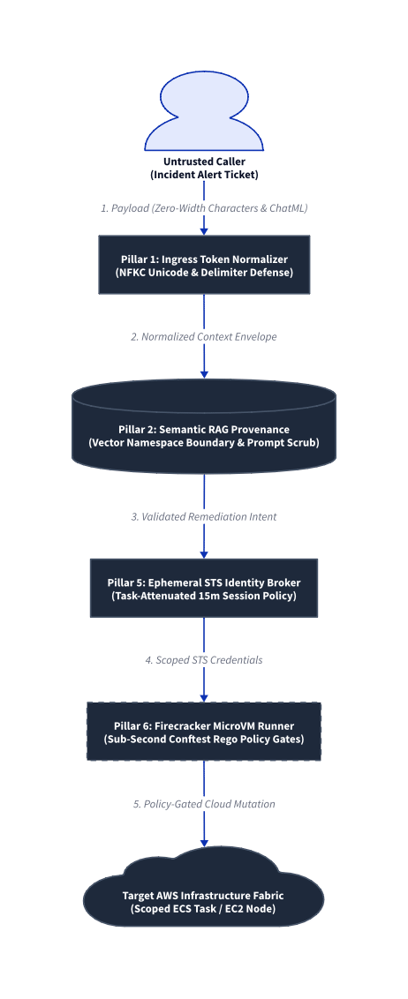
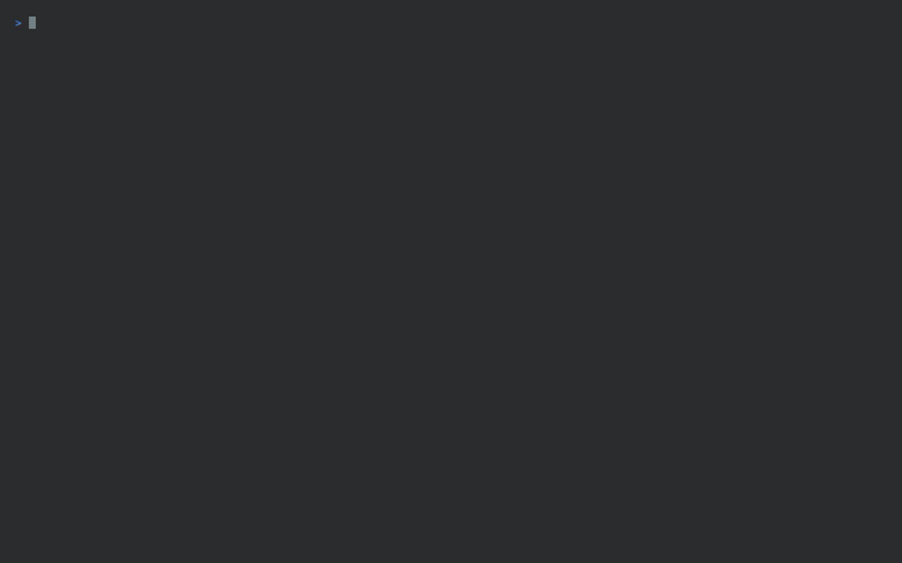

# AWS AI Security Platform: 6-Pillar Reference Implementation

[](LICENSE)
[](terraform/)
[](src/policy/rego/)
[](src/sandbox_runner/)

An end-to-end, deterministic security architecture built on AWS designed to secure autonomous AI agent runtimes and LLM workloads. This platform bridges the seam where probabilistic model reasoning touches deterministic cloud infrastructure—eliminating token smuggling, indirect prompt injection, model weight tampering, and non-human identity (NHI) privilege escalation.

---

## Architectural Threat Model: The Physics-to-Cognition Stack

| Abstraction Layer | Threat / Vulnerability Vector | Deterministic Control Plane |
| :--- | :--- | :--- |
| **Cognition / Ingress** | Tokenizer Smuggling & Split-Token Boundary Evasion | **Pillar 1:** Unicode NFKC & Token Normalizer Proxy |
| **Data / Semantic RAG** | Context Poisoning & Indirect Prompt Injection | **Pillar 2:** Vector Namespace Isolation & Sanitizer |
| **Model Artifacts** | Backdoored Checkpoints & Deserialization Exploits | **Pillar 3:** KMS-Backed Cosign Attestation & AIBOM |
| **Compute Fabric** | Unauthenticated RDMA Snooping & KV-Cache Bleed | **Pillar 4:** Air-Gapped Inference VPC (Zero Egress) |
| **Non-Human Identity** | Confused Deputy & Over-Privileged Static Keys | **Pillar 5:** Ephemeral STS Broker (Task-Scoped Sessions) |
| **Execution Host** | Unsandboxed MCP Tools & Runaway Billing Loops | **Pillar 6:** Firecracker MicroVMs & Conftest Rego Gates |

---

## The Golden Scenario: Autonomous SRE Incident Responder

### 1. Architectural Data Flow & Trust Boundaries
<p align="center">
  
</p>

### 2. Live Red vs. Blue Deterministic Verification
<p align="center">
  
</p>

All six defensive pillars are demonstrated through a single unified production workflow—an **Autonomous SRE Remediation Agent** responding to operational production alarms:

1. **Ingress:** An untrusted ticket enters via API Gateway. The Ingress Proxy validates Unicode forms and strips zero-width split tokens before prompt composition.
2. **Context:** The agent retrieves operational runbooks from S3. The RAG Sanitizer enforces tenant namespace boundaries and scrubs indirect prompt injections.
3. **Model Attestation:** The inference runtime verifies model weights (`.safetensors`) and CycloneDX AIBOM checksums against an asymmetric AWS KMS key.
4. **Isolated Fabric:** Model serving runs inside an air-gapped VPC with zero internet egress and isolated cache boundaries.
5. **Dynamic Identity:** The agent requests execution credentials. The STS Broker validates requested actions and generates a 15-minute attenuated session policy restricted strictly to target resource ARNs.
6. **Sandboxed Execution:** Remediation commands execute inside Firecracker-isolated Lambda microVMs, gated deterministically by Conftest Rego policies and an EventBridge circuit breaker.

---

## The 6-Pillar Defensive Matrix

| Pillar | AWS Primitive | Defensive Mechanism | Source |
| :--- | :--- | :--- | :--- |
| **1. Ingress Normalization** | API Gateway + Lambda | Enforces NFKC Unicode normalization; eliminates zero-width split tokens and strips ChatML/Llama delimiter injections (`<|im_start|>`). | `src/gateway/` |
| **2. Semantic Context Security** | Amazon S3 + KMS + Lambda | Validates vector metadata against authenticated tenant IDs; parses retrieved runbooks to drop imperative override phrases. | `src/rag_sanitizer/` |
| **3. Model Supply Chain** | AWS KMS + S3 Registry | Restricts runtime model loading exclusively to cryptographically attested `.safetensors` matching CycloneDX AIBOM SHA-256 manifests. | `src/attestation/` |
| **4. Inference Fabric Isolation** | VPC + Gateway Endpoints | Establishes an air-gapped VPC with zero internet gateways and zero NAT routing, restricting network traffic to internal VPC CIDRs and S3 endpoints. | `terraform/modules/04-inference-runtime/` |
| **5. Non-Human Identity (NHI)** | AWS STS + IAM | Eliminates static credentials. Issues short-lived STS credentials bounded by dynamic, task-attenuated inline session policies. | `src/sts_broker/` |
| **6. MicroVM Sandboxing** | AWS Lambda + Conftest | Executes tools inside Firecracker microVMs with zero ambient AWS permissions. Enforces Rego v1 invariants on IAM mutations and CLI parameters. | `src/sandbox_runner/` |

---

## Repository Layout

```text
aws-ai-security-platform/
├── .github/workflows/
│   ├── policy-test.yml              # Conftest Rego unit verification
│   └── sign-artifacts.yml           # Cosign KMS model signing & AIBOM workflow
├── architecture/
│   └── adr/                         # Architecture Decision Records (ADR 001–006)
├── src/
│   ├── gateway/                     # [Pillar 1] Ingress normalization proxy
│   ├── rag_sanitizer/               # [Pillar 2] RAG tenant filter & prompt sanitizer
│   ├── attestation/                 # [Pillar 3] AIBOM hash & format verification engine
│   ├── sts_broker/                  # [Pillar 5] Ephemeral STS credential broker
│   ├── sandbox_runner/              # [Pillar 6] Firecracker tool execution runner
│   └── policy/rego/                 # Rego v1 deterministic policy definitions
│       ├── iam_guardrails.rego
│       ├── tool_call_schema.rego
│       └── terraform_invariants.rego
├── terraform/
│   ├── environments/dev/            # Wired 6-pillar deployment environment
│   └── modules/
│       ├── 01-ingress-gateway/
│       ├── 02-rag-datastore/
│       ├── 03-model-registry/
│       ├── 04-inference-runtime/
│       ├── 05-sts-broker/
│       └── 06-sandbox-circuit/
└── tests/
    ├── exploits/                    # Deterministic attack payloads
    ├── harness/                     # Local test suites
    └── run-verification.sh          # Red vs. Blue dual-mode verification harness
```

---

## Quickstart & Verification

### Prerequisites
* Python 3.10+
* [Conftest](https://www.conftest.dev/) (`brew install conftest`)
* [Terraform](https://www.terraform.io/) 1.5+
* AWS CLI v2 (configured for deployment)

### 1. Run the Exploit vs. Defend Verification Suite
The repository includes an automated test harness demonstrating Red Team attacks against an unhardened baseline followed by Blue Team deterministic blocks across all six pillars:

```bash
# Execute the full Red vs. Blue suite locally
./tests/run-verification.sh --all
```

To run individual operational modes:
```bash
./tests/run-verification.sh --unprotected   # Simulates default AI system vulnerabilities
./tests/run-verification.sh --hardened      # Executes 6-pillar deterministic policy gates
```

### 2. Validate Infrastructure Code
```bash
cd terraform/environments/dev
terraform init
terraform validate
terraform plan
```

---

## Policy-as-Code Enforcement Details

All guardrails enforce strict **Rego v1** semantics to guarantee deterministic sub-second evaluation:

```bash
# Verify IAM escalation invariants
conftest test tests/exploits/payload_iam_escalate.json \
  --policy src/policy/rego/iam_guardrails.rego

# Verify Tool Call schema & command-injection invariants
conftest test tests/exploits/payload_tool_injection.json \
  --policy src/policy/rego/tool_call_schema.rego
```

---

## License

This project is licensed under the Apache 2.0 License - see the [LICENSE](LICENSE) file for details.
